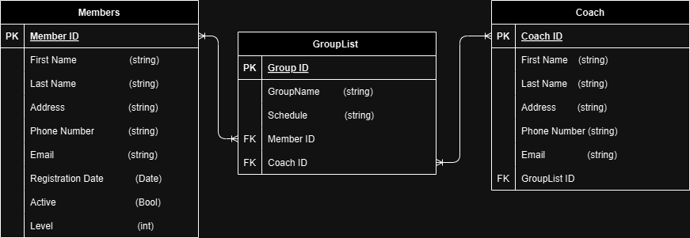

# NinjaClub

Ninja api for registering members, which users may own. 
------------------------------------------------------
------------------------------------------------------
please see below for instructions on how to run, and where its api and trello team resources are
------------------------------------------------------
How to run:
 - Open terminal in backend folder
 - use nodemon . to run backend
------------------------------------------------------
Team resources:
- https://studio.apicur.io/apis/112836
- https://trello.com/b/aCpIO62f/ninja-klubi-api
  
------------------------------------------------------

ERD
  

