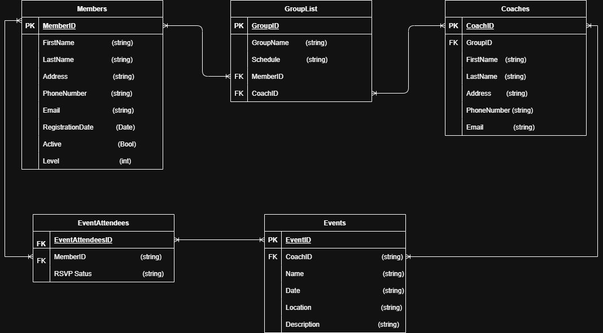

# NinjaClub

Ninja API for registering members, which users may own.

---

## Table of Contents
1. [How to Run](#how-to-run)
2. [Known Issues](#known-issues)
3. [Team Resources](#team-resources)
4. [Entity-Relationship Diagram (ERD)](#entity-relationship-diagram-erd)

---

## Overview

This document provides instructions for running the Ninja API, known issues, and details about team resources and the project’s Entity-Relationship Diagram (ERD).

---

## How to Run

### Installation
1. Open your terminal and navigate to the project’s root folder.
2. Run the following commands to install dependencies:
   ```bash
   npm run install-all
   ```
3. Wait for the installation to complete.

### Starting the Application
1. Run the following command to start the backend and frontend simultaneously:
   ```bash
   npm start
   ```

---

## Known Issues

### Common Installation Issue
- Ensure all dependencies are installed by running:
  ```bash
  npm install-all
  ```

### Vite Plugin Issue
- If you encounter problems with Vite, follow these steps:
  1. Navigate to the Frontend directory:
     ```bash
     cd ..\Frontend\frontend
     ```
  2. Install the missing Vite plugin for Vue:
     ```bash
     npm install -g @vitejs/plugin-vue
     ```
  3. Restart the development server:
     ```bash
     npm run dev
     ```

---

## Team Resources

- [API Documentation](https://studio.apicur.io/apis/112836)
- [Trello Board](https://trello.com/b/aCpIO62f/ninja-klubi-api)

---

## Entity-Relationship Diagram (ERD)

The ERD for the Ninja API can be found below:



